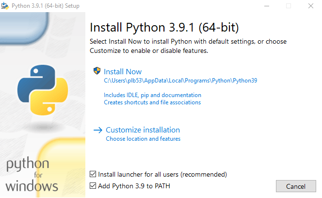

# Setup Instructions

1. Got to `https://www.python.org/downloads/` and download Python3. 
    
    NOTE: Ensure you select *Add Python to PATH*

    


2. Run the following in the Windows cmdline:

```
python -m pip install -U pip
python -m venv venv
.\venv\Scripts\activate
python -m pip install -r requirements.txt
```

# Running the Game

Run the following in the Windows cmdline:

```
python main.py
```